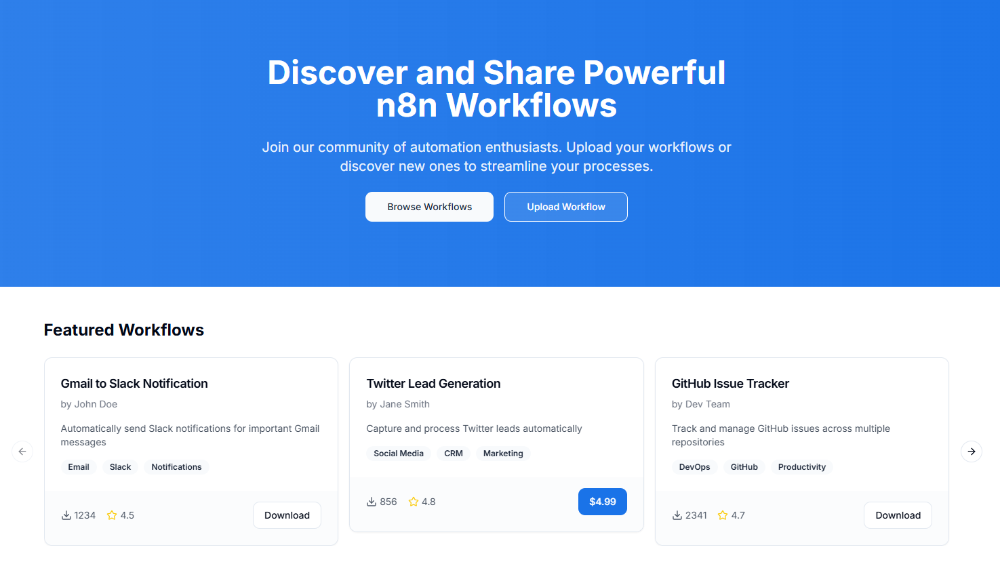

# FlowShare: An Open-Source Marketplace for Automation Flows



[](https://github.com/hipnologo/FlowShare/stargazers)
[](https://github.com/hipnologo/FlowShare/network)
[](https://github.com/hipnologo/FlowShare/issues)
[](https://github.com/hipnologo/FlowShare/issues)
[](https://github.com/hipnologo/FlowShare/commits/main)
[](https://github.com/hipnologo/FlowShare/pulls)

FlowShare is an open marketplace platform that enables automation enthusiasts to discover, share, and download workflows. Our platform makes it easy to browse, contribute, and implement automation solutions across various categories.

## 🌟 Features

- **Browse Workflows**: Explore a curated collection of automation workflows such as n8n
- **Share Your Workflows**: Upload and share your custom automation solutions
- **Featured Categories**: Find workflows across categories like:
  - Email Integration
  - Social Media Automation
  - CRM Systems
  - DevOps Tools
  - Marketing Automation
  - Notifications
  - Productivity Solutions

## 🚀 Live Demo

Visit our [Live Demo](https://flowshare.vercel.app/) to explore the platform.

## 💻 Tech Stack

This project is built with modern web technologies:
- Vite
- React
- TypeScript
- Tailwind CSS
- shadcn/ui

## 🛠️ Local Development

1. Clone the repository:
```bash
git clone https://github.com/hipnologo/FlowShare.git
```

2. Install dependencies:
```bash
cd FlowShare
npm install
```
3. Start the development server:
```bash
npm run dev
```

## 🤝 Contributing
We welcome contributions! Whether you want to:

- Submit your own workflows
- Improve the platform
- Report bugs
- Suggest features

Please feel free to submit a pull request or create an issue.

## 📱 Features in Development
- Enhanced workflow categorization
- User ratings and reviews
- Advanced search capabilities

## 🙏 Acknowledgments
- n8n community for inspiration and support
- All contributors who share their workflows
- shadcn/ui for the beautiful components

## 📄 License

FlowShare is licensed under the Apache License, Version 2.0. See [LICENSE](https://github.com/hipnologo/FlowShare/blob/main/LICENSE) for the full license text.

[](https://opensource.org/licenses/Apache-2.0)

Copyright (c) 2024 FlowShare

You can use this software according to the terms and conditions of the Apache License, Version 2.0. You may obtain a copy of the License at:

http://www.apache.org/licenses/LICENSE-2.0

Unless required by applicable law or agreed to in writing, software distributed under the License is distributed on an "AS IS" BASIS, WITHOUT WARRANTIES OR CONDITIONS OF ANY KIND, either express or implied. See the License for the specific language governing permissions and limitations under the License.
